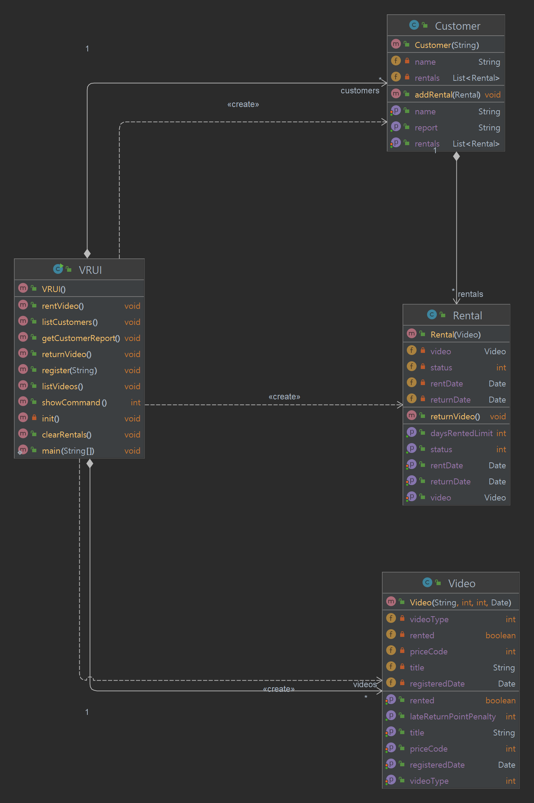
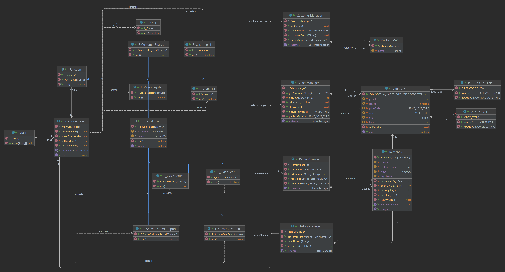
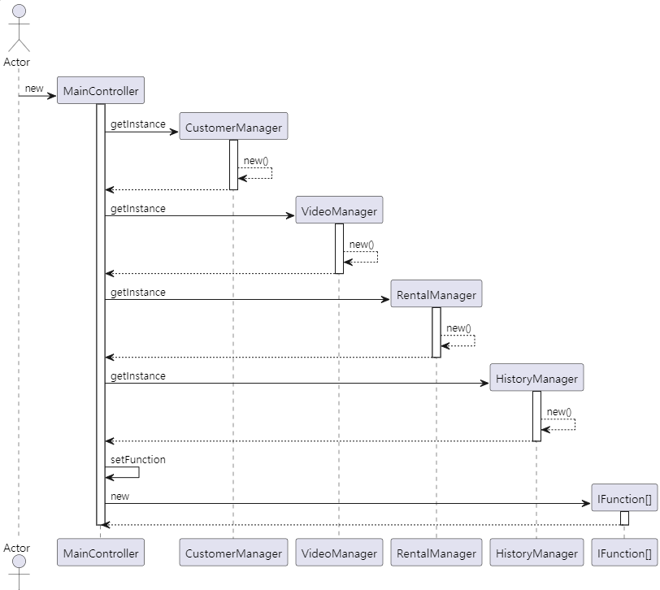
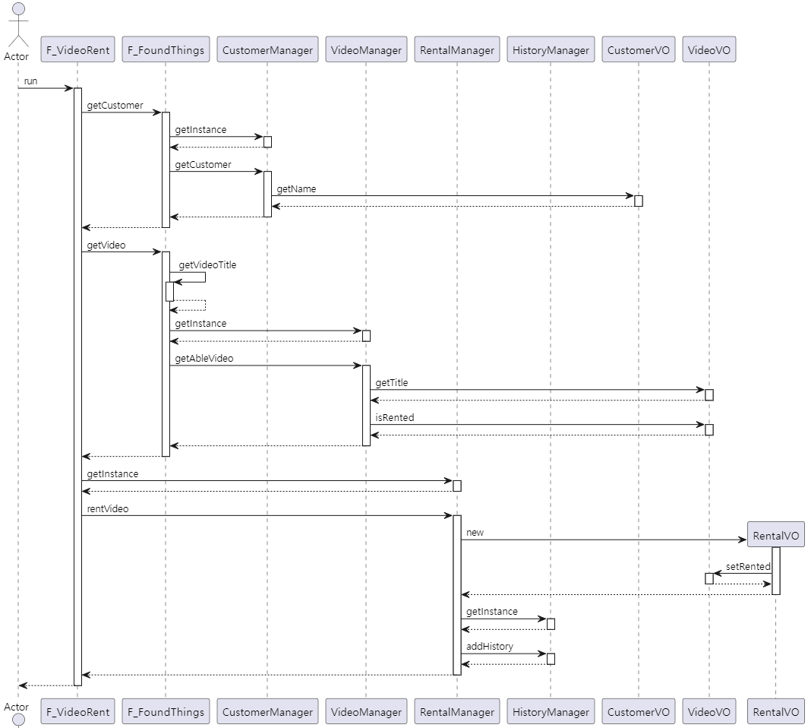

# AA_B3_Team4

## 1. origin Class Diagram



## 2. Big change from origin Project
### 2.1 change VRUI
```
	public static void main(String[] args) {
		mng = MainController.getInstance();
		System.out.println("do");
		while(mng.isRun()){
			mng.showCommand();
			mng.getCommand();
			mng.doCommand();
		}
	}
```
### 2.2 make function list and do command with command idx
```
    public abstract class IFunction {
        String name;
        public String funcName() {
            return name;
        }
        public abstract boolean run();
    }
     private List<IFunction> func;
     private void setFunction(){
        func.add(new F_Quit());
        func.add(new F_CustomerList());
        func.add(new F_VideoList());
        func.add(new F_CustomerRegister(scanner));
        func.add(new F_VideoRegister(scanner));
        func.add(new F_VideoRent(scanner));
        func.add(new F_VideoReturn(scanner));
        func.add(new F_ShowCustomerReport(scanner));
        func.add(new F_ShowNClearRent(scanner));

    }
    public void doCommand(){
        quit = func.get(command).run();
    }
```
### 2.3 make Managers with SingleTon
```
public class CustomerManager {
    private static CustomerManager cMng = null;
    private List<CustomerVO> customers;

    private CustomerManager() {
        customers = new ArrayList<CustomerVO>();
    }

    public static CustomerManager getInstance() {
        if (cMng == null) cMng = new CustomerManager();
        return cMng;
    }
 }
 
public class HistoryManager {
    private static HistoryManager hMng = null;
    private List<RentalVO> History;

    private HistoryManager() {
        History = new ArrayList<>();
    }

    public static HistoryManager getInstance() {
        if (hMng == null) hMng = new HistoryManager();
        return hMng;
    }
 public class RentalManager {
    private static RentalManager rMng = null;
    private List<RentalVO> rentalList;
    private List<RentalVO> CustomerRental;

    private RentalManager() {
        rentalList = new ArrayList<RentalVO>();
    }

    public static RentalManager getInstance() {
        if (rMng == null) rMng = new RentalManager();
        return rMng;
    }
 }
 public class VideoManager {
    private static VideoManager vMng = null;
    private List<VideoVO> videoList;


    private VideoManager() {
        videoList = new ArrayList<>();
    }

    public static VideoManager getInstance() {
        if (vMng == null) vMng = new VideoManager();
        return vMng;
    }
 }
 ```

## 3. Refactoring Class Diagram


## 4. Refactoring Examples

### 4.1 Initial Creations


### 4.2 Rent Flow

